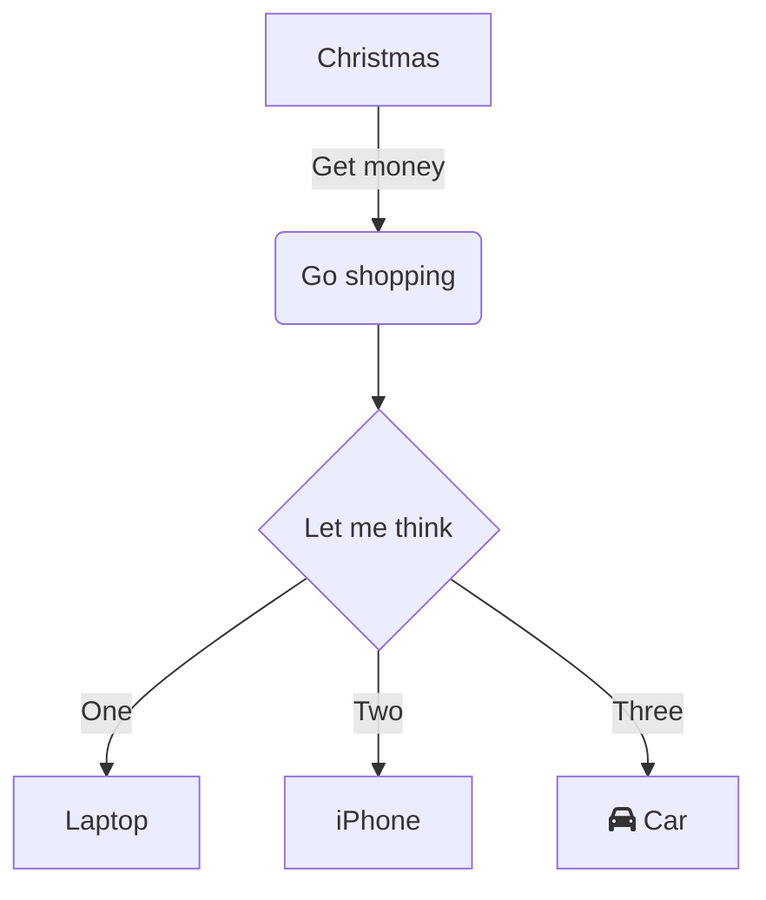
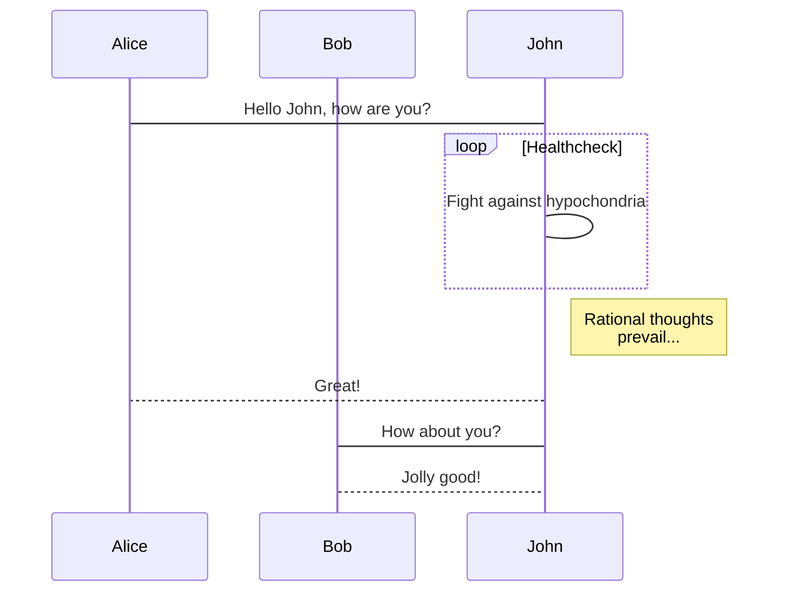

# Markdown based github pages using different md renderer

Todo:
- [x] Render using tui.editor
- [ ] Support for mermaid in fences
- [ ] Solve lack of .hljs on pre (lack of style background from highlight.js themes for code :/)
- [ ] Customize or pick better theme

A **simple** md *file*

A list
- a
- b
- c

[link to nowhere](nowhere)


Java code
```java
public static void hello() {
    System.out.println("world");
}
```

shell code
```sh
echo "hello world"
```


A graph


Sequence diagram
